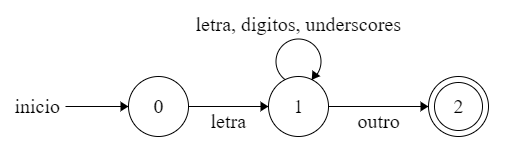
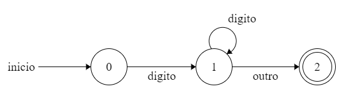
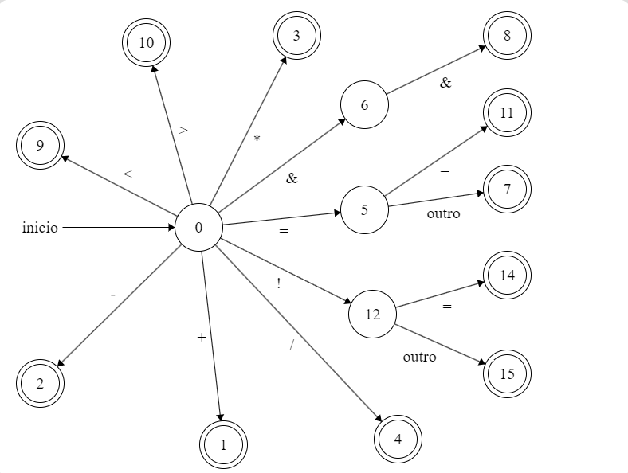
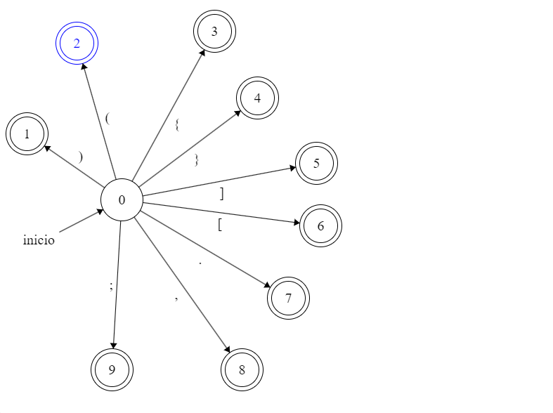

# Compiladores I (2024.1)

- O seguinte repositório tem como objetivo armazenar códigos referentes ao trabalho final da disciplina de Compiladores I do primeiro semestre de 2024 do curso de Ciência da Computação da UFMS.

- compilador: g++

- como compilar o programa:

```
g++ token.h
g++ scanner.h
g++ -o scanner scanner.cpp principal.cpp
```

# Funcionalidades atuais
- Implementação do scanner.
  * Realiza a identificação dos tokens até ocorrer EOF.
  * Desconsideração dos espaços.
  * Reconhecimento de tokens inválidos (erro), porém sem tratamento.

# Tokens da linguagem

1. Identificadores (ID): Uma sequência de letras, dígitos e underscores, começando sempre com
uma letra. A linguagem distingue letras maiúsculas e minúsculas. As definições regulares referentes são:
  * letra: [a-zA-Z];
  * letras: letra+;
  * dígito: [0-9];
  * dígitos: dígito+ (uma ou mais ocorrências de um dígito);
  * underscore: [_];
  * underscores: underscore+;

    Autômato correspondente: <br >
  


2. Números inteiros (INTEGER_LITERAL): uma sequência de dígitos decimais, que denotam o número inteiro correspondente. <br >
    Autômato correspondente: <br >
  


3. Operadores (OP): &&, <, >, +, −, ∗, /, =, ==, ! = e ! <br>
    Autômato correspondente: <br >
    

4. Separadores (SEP): (, ), [, ], {, }, ;, . e ,;<br>
    Autômato correspondente: <br >
    

5. Palavras reservadas: boolean, class, else, extends, false, if, int, length,
main, new, public, return, static, String, System.out.println, this, true,
void e while;
6. Comentários: os comentários devem ser ignorados. Existem dois tipos: comentário de linha
(iniciado com // e indo até o final da linha) e comentário de bloco (iniciado com /∗ e encerrado
em ∗/ sem aninhamentos);
7. Espaços em branco: devem ser ignorados. São eles \n, \t, \r e \f.
